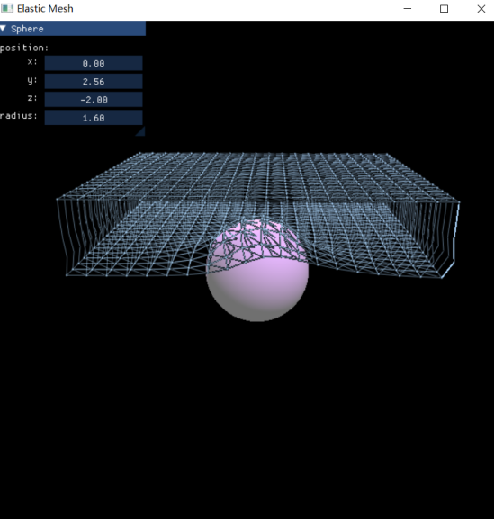

1）绳子模拟

略。

2）布料模拟

固定网格的两个顶点，网格将在重力影响下被水平释放，由于网格初始处于松弛状态，刚释放时网格中无弹力产生，大多数结点做自由落体运动。旋转视角，此时的网格中越来越多的结点受到结点间弹簧的弹力影响偏离原先的下降轨迹。

在网格未碰到球体前将球体缩小至可以让网格直接穿过球体的大小，布料将绕两个静止的顶点所属的边来回晃动，同时受重力影响靠近中间的部分会向下塌陷。

下面测试对球体的碰撞检测。保持球体处于初始位置，让网格自由下落，网格碰到球体后会将球体部分包裹，并依靠惯性继续向前运动。将球体向右拉离网格，待网格稳定后控制球体迅速向左移动，网格向左塌陷并产生与球体碰撞方向相同的力。

固定网格的四个顶点并释放，网格小幅上下跳动逐渐趋于稳定。将球体放置于网格上方并逐渐向下拉，网格随之运动。

3）三维网格模拟

只固定最上面一层Quad的四个顶点，并设置两层Quad，任其受重力影响自由下落，效果如下：

下图展示了碰撞检测的效果，固定了最上面一层Quad的所有结点，球体碰撞后下移，网格体逐渐恢复原来的形状。

